# 🌍 Mahanayak

<div align="center">


**AI-Powered Environmental Event Management Platform**

*Orchestrating environmental change through intelligent automation*

[](https://fastapi.tiangolo.com/)
[](https://nextjs.org/)
[](https://ai.pydantic.dev/)
[](https://langchain-ai.github.io/langgraph/)
[](https://www.copilotkit.ai/)

</div>

## Overview

Mahanayak is a revolutionary environmental event management platform that harnesses the power of agentic AI to streamline the planning, execution, and management of environmental drives. From tree plantation campaigns to beach cleanups, our intelligent agents work in harmony to make environmental initiatives more impactful and efficient.

## 🎯 Key Features

### 🤖 Intelligent Agent Orchestra
- **6 Specialized AI Agents** working in perfect harmony
- **Pydantic AI** for individual agent intelligence
- **LangGraph** for seamless agent orchestration
- **Dynamic workflow adaptation** based on event requirements

### 🛠️ Comprehensive Automation
- **Content Creation** with social media integration
- **Government Permission** handling with automated emails
- **Resource Optimization** with real-time price monitoring
- **Volunteer Management** with PDF guidelines generation
- **Smart Reminders** with Google Calendar integration
- **Feedback Collection** with automated Google Forms

### 💡 Modern Tech Stack
- **Backend**: FastAPI for high-performance APIs
- **Frontend**: Next.js with Copilot Kit for intelligent UI
- **Storage**: Supabase for scalable data management
- **Integrations**: LinkedIn, Twitter, Google Workspace, Email

## 🏗️ Architecture

```mermaid
graph TD
    A[👤 User] --> B[🖥️ Next.js Frontend]
    B --> C[🚀 FastAPI Backend]
    C --> D[🧠 LangGraph Orchestrator]
    D --> E[🤖 Pydantic AI Agents]
    
    E --> F[📝 Content Creation Agent]
    E --> G[📋 Volunteer Guidelines Agent]
    E --> H[📊 Feedback Agent]
    E --> I[⏰ Reminder Agent]
    E --> J[💰 Resource Agent]
    E --> K[🏛️ Permission Agent]
    
    F --> L[🔗 LinkedIn/Twitter API]
    G --> M[📄 PDF Generator + Supabase]
    H --> N[📋 Google Forms API]
    I --> O[📅 Google Calendar API]
    J --> P[🔍 Web Search API]
    K --> Q[📧 Email Service]
```



## 🤖 AI Agents & Tools

### 📝 Content Creation Agent
- **Purpose**: Generate compelling content for social media and communications
- **Tools**: LinkedIn API, Twitter API
- **Output**: Professional posts, promotional content, awareness campaigns

### 📋 Volunteer Guidelines Agent  
- **Purpose**: Create comprehensive volunteer documentation
- **Tools**: PDF Generator, Supabase Storage
- **Output**: Interactive handbooks, safety guidelines, training materials

### 📊 Feedback Agent
- **Purpose**: Collect and analyze participant feedback
- **Tools**: Google Forms API, Analytics Dashboard
- **Output**: Custom feedback forms, participation metrics, impact analysis

### ⏰ Reminder Agent
- **Purpose**: Manage schedules and automated notifications
- **Tools**: Google Calendar API, Notification Service
- **Output**: Event reminders, milestone alerts, timeline management

### 💰 Resource Agent
- **Purpose**: Optimize resources and budget planning
- **Tools**: Web Search API, Price Comparison
- **Output**: Cost estimates, vendor comparisons, resource optimization

### 🏛️ Permission Agent
- **Purpose**: Handle government approvals and permissions
- **Tools**: Email Service, Document Generator
- **Output**: Permission letters, authority communications, compliance reports

## 🛠️ Installation & Setup

### Prerequisites
- Python 3.9+
- Node.js 16+
- pnpm package manager
- uv (Python package manager)

### 🔧 Backend Setup

1. **Clone the repository**
   ```bash
   git clone https://github.com/your-username/mahanayak.git
   cd mahanayak
   ```

2. **Navigate to backend directory**
   ```bash
   cd backend
   ```

3. **Install dependencies**
   ```bash
   uv sync
   ```

4. **Configure environment variables**
   ```bash
   cp .env.example .env
   # Edit .env with your API keys and configuration
   ```

5. **Run the backend server**
   ```bash
   uv run run.py
   ```

### Frontend Setup

1. **Navigate to frontend directory**
   ```bash
   cd frontend
   ```

2. **Install dependencies**
   ```bash
   pnpm install
   ```

3. **Start the development server**
   ```bash
   pnpm run dev
   ```

## 🤝 Contributing

We welcome contributions! Please see [CONTRIBUTING.md](CONTRIBUTING.md) for guidelines.

1. Fork the repository
2. Create your feature branch (`git checkout -b feature/AmazingFeature`)
3. Commit your changes (`git commit -m 'Add some AmazingFeature'`)
4. Push to the branch (`git push origin feature/AmazingFeature`)
5. Open a Pull Request

## 📄 License

This project is licensed under the MIT License - see the [LICENSE](LICENSE) file for details.

---

<div align="center">

**Made with 💚 for our planet**

*Mahanayak - Where AI meets environmental action*

</div>
