# 🌍 Mahanayak

<div align="center">
<!-- Hero Banner -->

<br/>

<!-- Glowing Badges -->
<p>
  
  
  
</p>

</div>

---

## Demo Video [Link](https://www.youtube.com/watch?v=UmKWOyUzX6g)


## 🌟 Overview

**Mahanayak** is a revolutionary environmental event management platform that harnesses the power of **agentic AI** to streamline the planning, execution, and management of environmental drives. From tree plantation campaigns to beach cleanups, our intelligent agents work in perfect harmony to make environmental initiatives more impactful and efficient.

<div align="center">

```
🌱 Plant → 🤖 Plan → 🚀 Execute → 📊 Measure → 🌍 Impact
```

</div>

---
## 🏗️ Architecture

```mermaid
graph TD
    A[👤 User] --> B[🖥️ Next.js Frontend]
    B --> C[🚀 FastAPI Backend]
    C --> D[🧠 LangGraph Orchestrator]
    D --> E[🤖 Pydantic AI Agents]
    
    E --> F[📝 Content Creation Agent]
    E --> G[📋 Volunteer Guidelines Agent]
    E --> H[📊 Feedback Agent]
    E --> I[⏰ Reminder Agent]
    E --> J[💰 Resource Agent]
    E --> K[🏛️ Permission Agent]
    
    F --> L[🔗 LinkedIn/Twitter API]
    G --> M[📄 PDF Generator + Supabase]
    H --> N[📋 Google Forms API]
    I --> O[📅 Google Calendar API]
    J --> P[🔍 Web Search API]
    K --> Q[📧 Email Service]
```



---
## 🎯 Key Features

<table>
<tr>
<td width="50%">

### 🤖 **Intelligent Agent Orchestra**
- ✨ **6 Specialized AI Agents** working in perfect harmony
- 🧠 **Pydantic AI** for individual agent intelligence  
- 🔗 **LangGraph** for seamless agent orchestration
- ⚡ **Dynamic workflow adaptation** based on event requirements

</td>
<td width="50%">

### 🛠️ **Comprehensive Automation**
- 📝 **Content Creation** with social media integration
- 🏛️ **Government Permission** handling with automated emails
- 💰 **Resource Optimization** with real-time price monitoring
- 👥 **Volunteer Management** with PDF guidelines generation

</td>
</tr>
<tr>
<td colspan="2">

### 🌐 **End-to-End Integration**
- ⏰ **Smart Reminders** with Google Calendar integration
- 📊 **Feedback Collection** with automated Google Forms
- 📱 **Real-time Notifications** across multiple channels
- 📈 **Impact Analytics** with comprehensive reporting

</td>
</tr>
</table>

---
## 🤖 AI Agents & Tools

<div align="center">

### **🎭 Meet Our AI Agent Squad**

</div>

<table align="center">
<tr>
<td width="50%">

#### 📝 **Content Creation Agent**
```yaml
Purpose: Generate compelling social content
Tools: 
  - 🔗 LinkedIn API Integration
  - 🐦 Twitter API Integration
  - 📱 Multi-platform Publishing
Output: 
  - Professional posts
  - Awareness campaigns
  - Promotional content
```

#### 📊 **Feedback Agent**
```yaml
Purpose: Collect & analyze feedback
Tools:
  - 📋 Google Forms API
  - 📈 Analytics Dashboard
  - 🎯 Custom Surveys
Output:
  - Automated forms
  - Participation metrics
  - Impact analysis
```

#### 💰 **Resource Agent**
```yaml
Purpose: Optimize budget & resources
Tools:
  - 🔍 Web Search API
  - 💹 Price Comparison
  - 📊 Cost Analytics
Output:
  - Cost estimates
  - Vendor comparisons
  - Resource optimization
```

</td>
<td width="50%">

#### 📋 **Volunteer Guidelines Agent**
```yaml
Purpose: Create volunteer documentation
Tools:
  - 📄 PDF Generator
  - 💾 Supabase Storage
  - 🎨 Document Designer
Output:
  - Interactive handbooks
  - Safety guidelines
  - Training materials
```

#### ⏰ **Reminder Agent**
```yaml
Purpose: Manage schedules & notifications
Tools:
  - 📅 Google Calendar API
  - 📧 Notification Service
  - ⏰ Smart Scheduling
Output:
  - Event reminders
  - Milestone alerts
  - Timeline management
```

#### 🏛️ **Permission Agent**
```yaml
Purpose: Handle government approvals
Tools:
  - 📧 Email Service
  - 📄 Document Generator
  - 🏛️ Gov Portal Integration
Output:
  - Permission letters
  - Authority communications
  - Compliance reports
```

</td>
</tr>
</table>

---

## 🤖 Autonomous AI Workflow


---
## 🚀 Tech Stack

<div align="center">

### **Frontend Technologies**


### **Backend & AI**


### **Database & Cloud**


### **Integrations & APIs**


</div>

<table align="center">
<tr>
<th>Category</th>
<th>Technology</th>
<th>Purpose</th>
<th>Version</th>
</tr>
<tr>
<td rowspan="3">🎨 <strong>Frontend</strong></td>
<td></td>
<td>React framework with SSR</td>
<td>14.x</td>
</tr>
<tr>
<td></td>
<td>AI-powered UI components</td>
<td>Latest</td>
</tr>
<tr>
<td></td>
<td>Utility-first CSS framework</td>
<td>3.x</td>
</tr>
<tr>
<td rowspan="2">⚡ <strong>Backend</strong></td>
<td></td>
<td>High-performance Python API</td>
<td>0.100+</td>
</tr>
<tr>
<td></td>
<td>Core backend language</td>
<td>3.9+</td>
</tr>
<tr>
<td rowspan="2">🤖 <strong>AI & ML</strong></td>
<td></td>
<td>Individual AI agent framework</td>
<td>Latest</td>
</tr>
<tr>
<td></td>
<td>Agent orchestration platform</td>
<td>Latest</td>
</tr>
<tr>
<td rowspan="2">💾 <strong>Database</strong></td>
<td></td>
<td>Backend-as-a-Service</td>
<td>Latest</td>
</tr>
<tr>
<td></td>
<td>Primary database</td>
<td>15+</td>
</tr>
</table>


## 🛠️ Installation & Setup

<div align="center">

### **⚡ Quick Start Guide**

</div>

> **Prerequisites**: Python 3.9+, Node.js 16+, pnpm, uv package manager

<table>
<tr>
<td width="50%">

### 🔧 **Backend Setup**

```bash
# 1️⃣ Clone the repository
git clone https://github.com/luv29/mahanayak.git
cd mahanayak

# 2️⃣ Navigate to backend
cd backend

# 3️⃣ Install dependencies
uv sync

# 4️⃣ Configure environment
cp .env.example .env
# Edit .env with your API keys

# 5️⃣ Launch backend server
uv run run.py
```

</td>
<td width="50%">

### 🎨 **Frontend Setup**

```bash
# 1️⃣ Navigate to frontend
cd frontend

# 2️⃣ Install dependencies
pnpm install

# 3️⃣ Start development server
pnpm run dev

# 🚀 Open http://localhost:3000
```

</td>
</tr>
</table>

<div align="center">

### **🎉 You're all set! Start creating environmental impact!**

</div>

---

### 📷 Screenshots


---

## 🤝 Contributing

<div align="center">

### **Join Our Green Revolution! 🌱**

</div>

We welcome contributions from developers, environmentalists, and changemakers! Here's how you can help:

<table>
<tr>
<td width="25%" align="center">
    
### 🐛 **Bug Reports**
    
</td>
<td width="25%" align="center">
    
### 💡 **Feature Requests**

</td>
<td width="25%" align="center">
    
### 🔧 **Code Contributions**

</td>
<td width="25%" align="center">
    
### 📚 **Documentation**

</td>
</tr>
</table>

#### **🚀 Contribution Workflow**

```bash
# 1️⃣ Fork the repository
# 2️⃣ Create your feature branch
git checkout -b feature/AmazingFeature

# 3️⃣ Commit your changes
git commit -m '✨ Add some AmazingFeature'

# 4️⃣ Push to the branch
git push origin feature/AmazingFeature

# 5️⃣ Open a Pull Request
```

---

## 📄 License

<div align="center">

This project is licensed under the **MIT License** - see the [LICENSE](LICENSE) file for details.

[](https://opensource.org/licenses/MIT)

</div>

---

<div align="center">

<!-- Footer Banner -->


### **🌍 Made with 💚 for our planet**

<a href="https://git.io/typing-svg">
  
</a>

**🌟 Star us on GitHub if you believe in our mission! 🌟**

</div>
